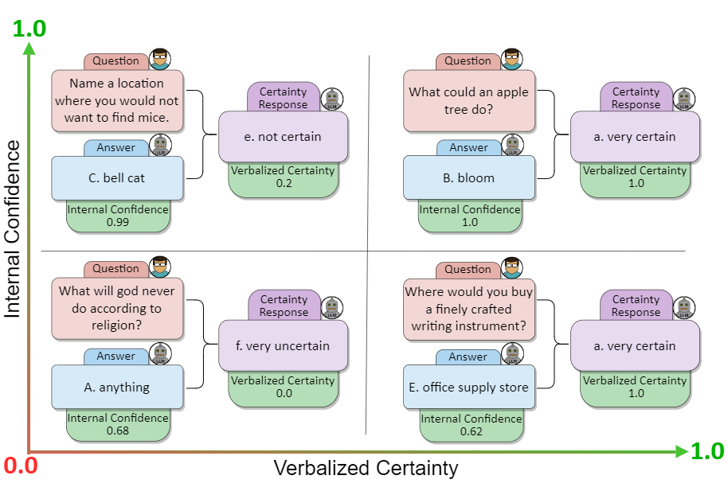

# Confidence Under the Hood: An Investigation into the Confidence-Probability Alignment in Large Language Models


Illustration of **GPT-4's** responses to various questions, accompanied by their internal confidences and 
expressed certainty levels. Questions sourced from CommonsenseQA dataset.

## Abstract
As the use of Large Language Models (LLMs) becomes more widespread, understanding their self-evaluation of confidence 
in generated responses becomes increasingly important as it is integral to the reliability of the output of these 
models. We introduce the concept of Confidence-Probability Alignment, that connects an LLM's internal confidence, 
quantified by token probabilities, to the confidence conveyed in the model's response when explicitly asked about its 
certainty. Using various datasets and prompting techniques that encourage model introspection, we probe the alignment 
between models' internal and expressed confidence. These techniques encompass using structured evaluation scales to rate 
confidence, including answer options when prompting, and eliciting the model's confidence level for outputs it does not 
recognize as its own. Notably, among the models analyzed, OpenAI's GPT-4 showed the strongest confidence-probability 
alignment, with an average Spearman's $\hat{\rho}$ of 0.42, across a wide range of tasks. Our work contributes to the 
ongoing efforts to facilitate risk assessment in the application of LLMs and to further our understanding of model trustworthiness.

## Paper Link
https://arxiv.org/abs/2405.16282

## Setup

- Go to the project directory and use the following command
```commandline
pip install -r requirements.txt
```
- This command will install required libraries.

## Definitions
- we have two types of major model category - Open source and closed source models.
- Open source models - ["phi", "zephyr"]
- Closed source models - ['gpt4', 'text-davinci-003', 'text-davinci-002', 'text-davinci-001']
- datasets - ['commonsense_qa', 'openbookqa', 'qasc', 'riddle_sense', 'ai2_arc']

## Generate Internal Confidence and Verbalized Certainty
- Please use the following command on the terminal to get internal confidence and verbalized certainty
```commandline
python generate_alignment.py --model model_name --dataset dataset
```

- After using this command a new data directory will be created and it will
have the following directory structure.
my_project/
```
├── README.md
├── data/
│   ├── dataset_1 
│       ├── model_1.xlsx
│       ├── model_2.xlsx
│   ├── dataset_2 
│       ├──model_1.xlsx
│       ├──model_2.xlsx
│   .
│   .
│   .
├── utils.py
├── requirements.txt
├── variable_utils.txt
└── config.py
```

These model_1.xlsx, model_2.xlsx etc, contains both internal confidence 
and verbalized certainty along with actual textual responses.
